# 📐 TOUS LES DIAGRAMMES UML - PRÊTS À GÉNÉRER

## 🎯 INSTRUCTIONS RAPIDES

Pour chaque diagramme ci-dessous:

1. **Copiez** le code entre `@startuml` et `@enduml`
2. **Allez sur:** http://www.plantuml.com/plantuml/uml/
3. **Collez** le code dans l'éditeur
4. **Cliquez** sur le diagramme généré
5. **Téléchargez** l'image PNG
6. **Renommez** selon le nom indiqué

---

## 📊 ARCHITECTURE GÉNÉRALE

### Figure 1.1: Architecture MicroService

**Nom fichier:** `figure_1_1_architecture_microservice.png`

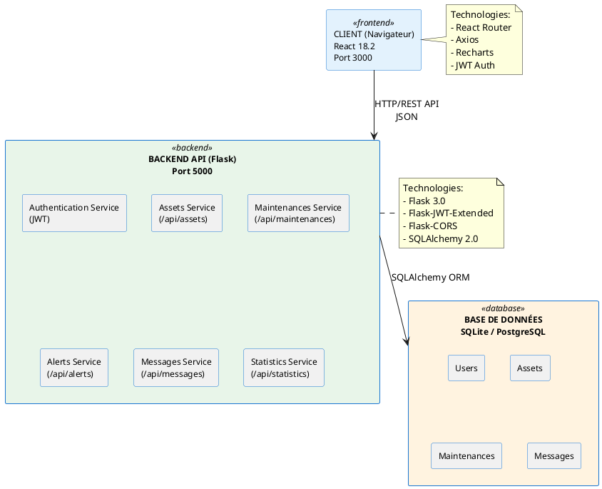

---

## 📦 CHAPITRE 2: CAPTURE DES BESOINS

### Figure 2.1: Diagramme de Cas d'Utilisation GLOBAL

**Nom fichier:** `figure_2_1_uc_global.png`

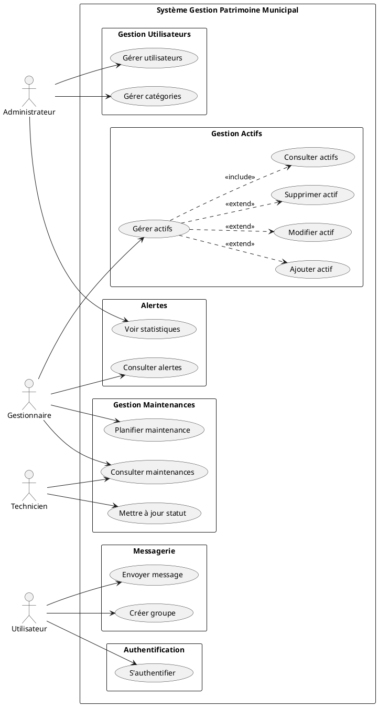

---

### Figure 2.2: Diagramme de Déploiement

**Nom fichier:** `figure_2_2_deploiement.png`

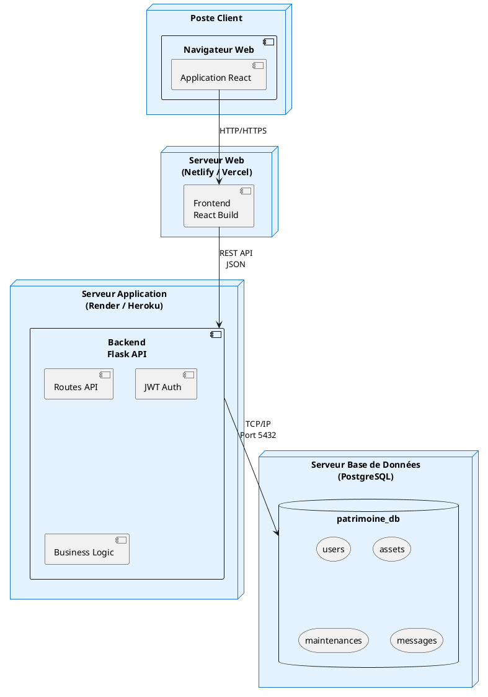

---

## 🔐 SPRINT 1: ADMINISTRATEUR

### Figure 3.1: Cas d'Utilisation "S'authentifier"

**Nom fichier:** `figure_3_1_uc_authentification.png`

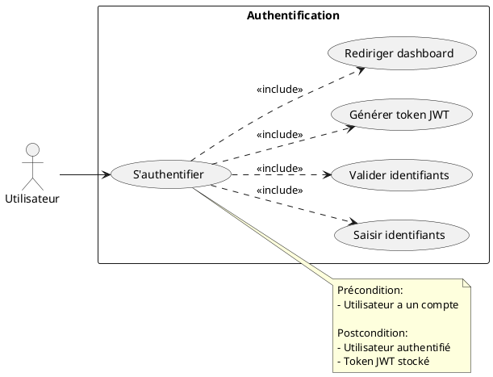

---

### Figure 3.2: Cas d'Utilisation "Gérer Utilisateurs"

**Nom fichier:** `figure_3_2_uc_gerer_utilisateurs.png`

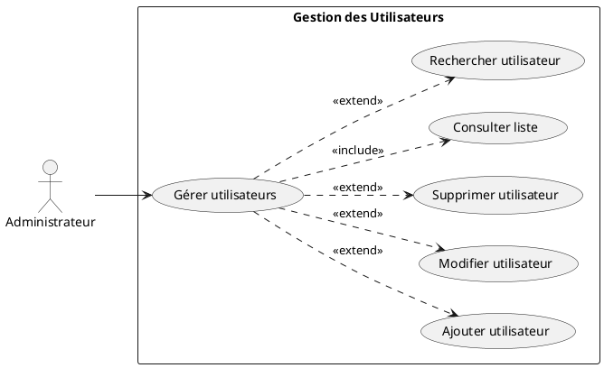

---

### Figure 3.3: Séquence "Authentification"

**Nom fichier:** `figure_3_3_seq_authentification.png`

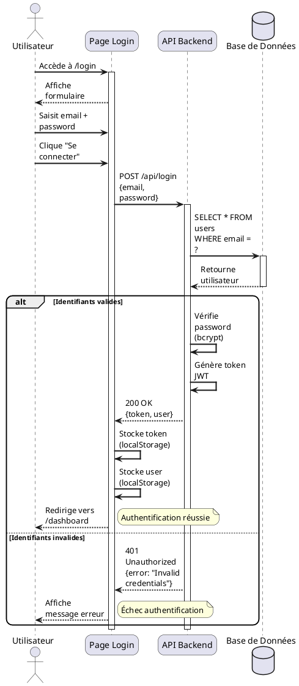

---

### Figure 3.4: Séquence "Créer Utilisateur"

**Nom fichier:** `figure_3_4_seq_creer_utilisateur.png`

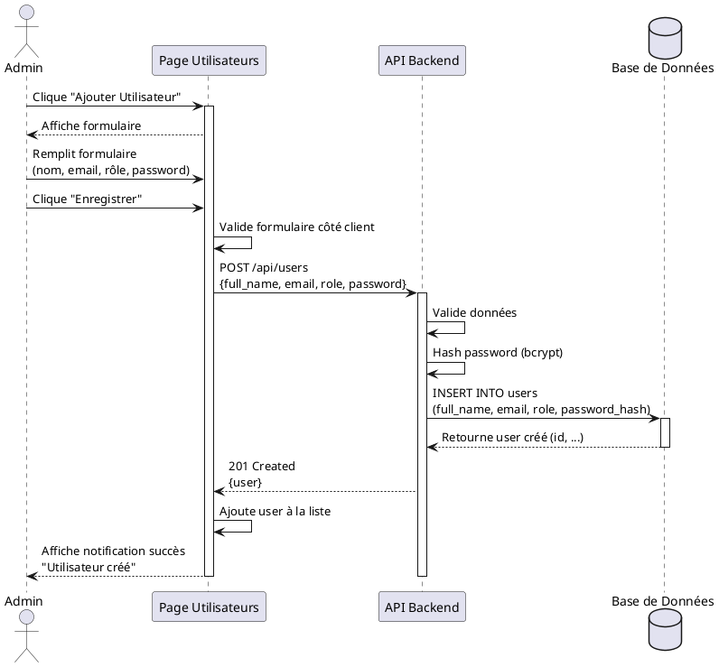

---

### Figure 3.5: Séquence "Dashboard Statistiques"

**Nom fichier:** `figure_3_5_seq_dashboard.png`

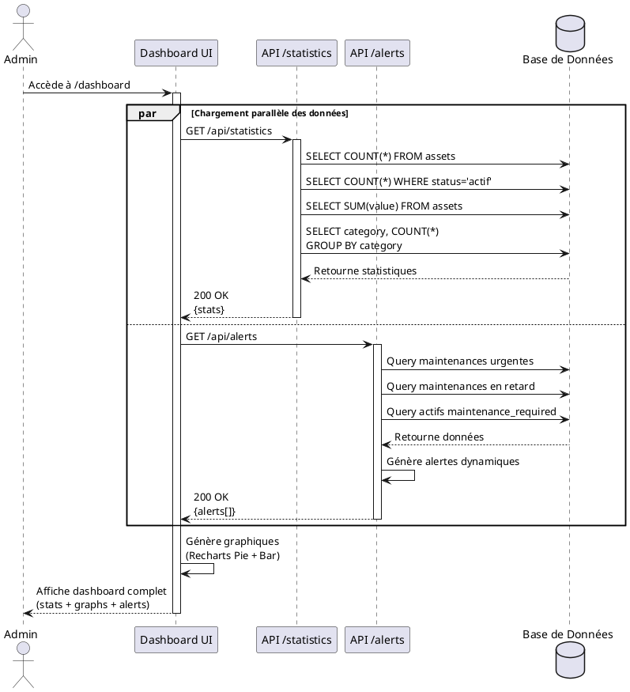

---

### Figure 3.6: Diagramme de Classes Sprint 1

**Nom fichier:** `figure_3_6_classes_sprint1.png`

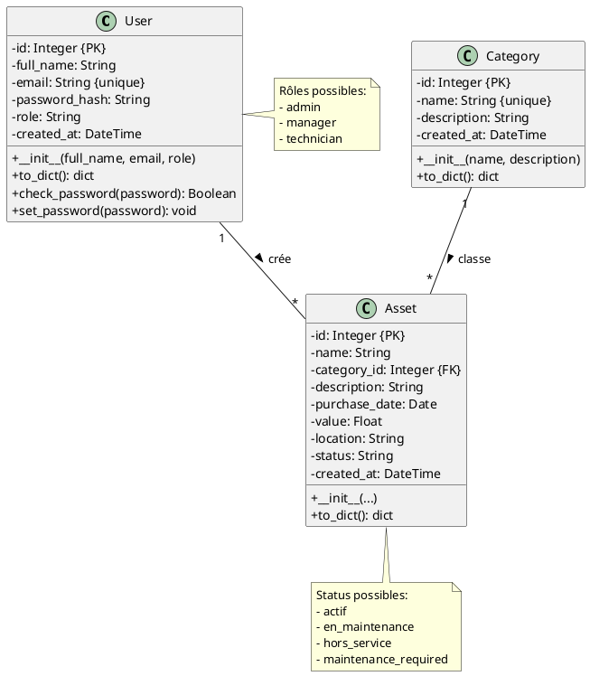

---

## 📦 SPRINT 2: GESTIONNAIRE D'ACTIFS

### Figure 4.1: Cas d'Utilisation Gestionnaire

**Nom fichier:** `figure_4_1_uc_gestionnaire.png`

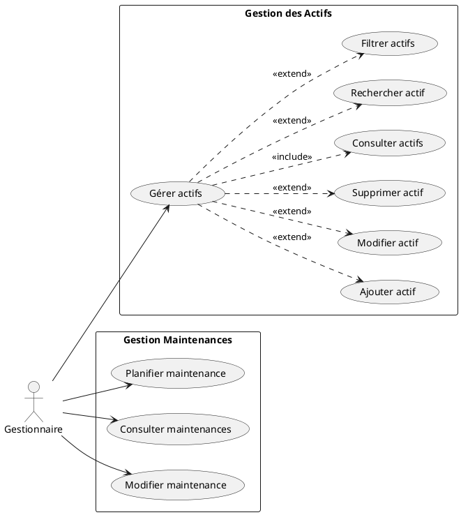

---

### Figure 4.2: Diagramme de Classes Sprint 2

**Nom fichier:** `figure_4_2_classes_sprint2.png`

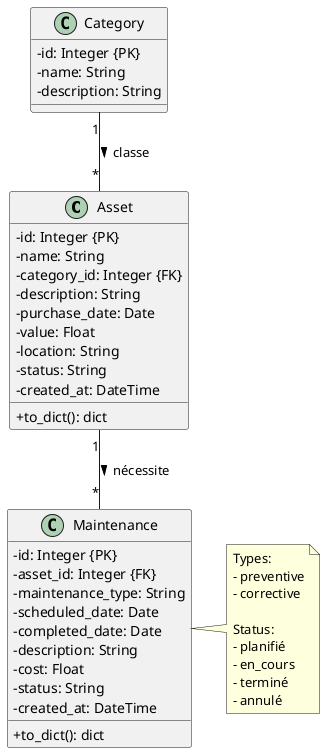

---

### Figure 4.3: Séquence "Ajouter Actif"

**Nom fichier:** `figure_4_3_seq_ajouter_actif.png`

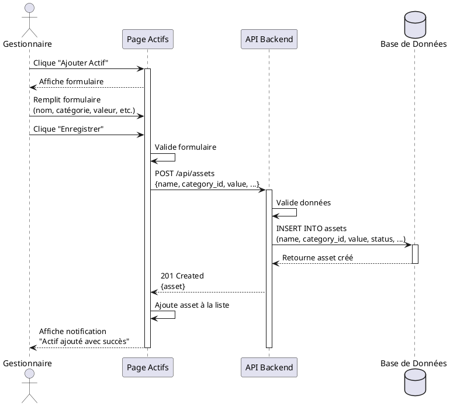

---

### Figure 4.4: Séquence "Planifier Maintenance"

**Nom fichier:** `figure_4_4_seq_planifier_maintenance.png`

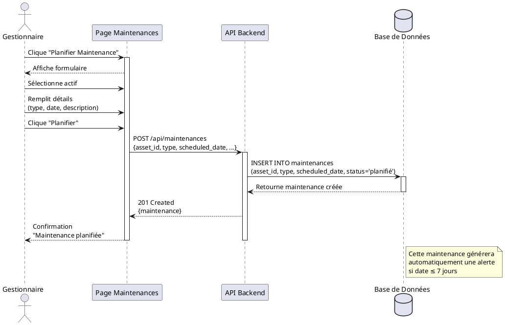

---

## 🔧 SPRINT 3: GESTION MAINTENANCES

### Figure 5.1: Cas d'Utilisation Maintenances

**Nom fichier:** `figure_5_1_uc_maintenances.png`

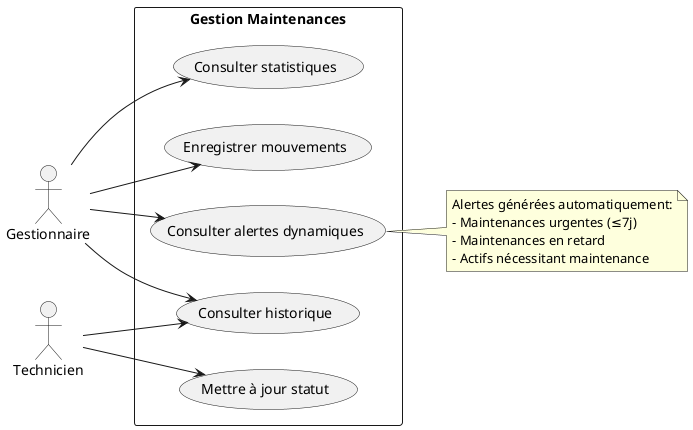

---

### Figure 5.2: Diagramme de Classes Sprint 3

**Nom fichier:** `figure_5_2_classes_sprint3.png`

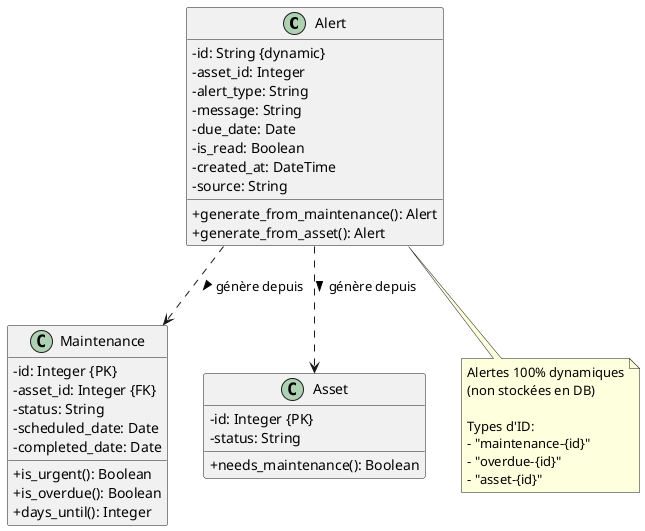

---

### Figure 5.3: Séquence "Consulter Alertes Dynamiques"

**Nom fichier:** `figure_5_3_seq_alertes.png`

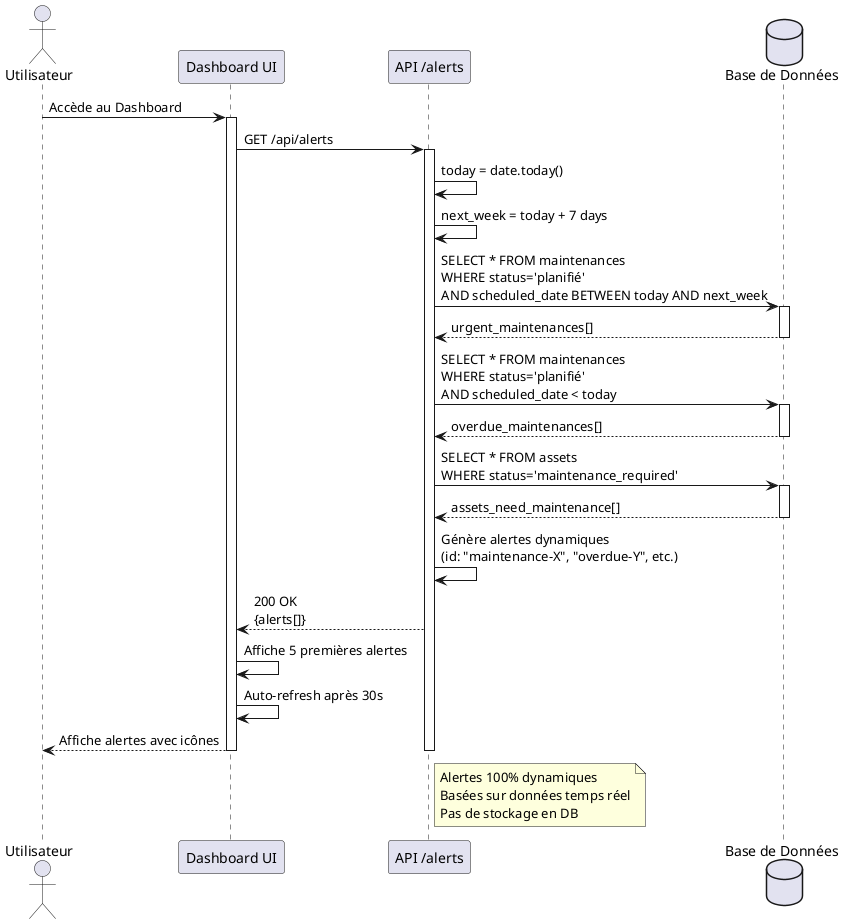

---

### Figure 5.4: Diagramme d'Activité "Suivre Maintenance"

**Nom fichier:** `figure_5_4_activite_maintenance.png`

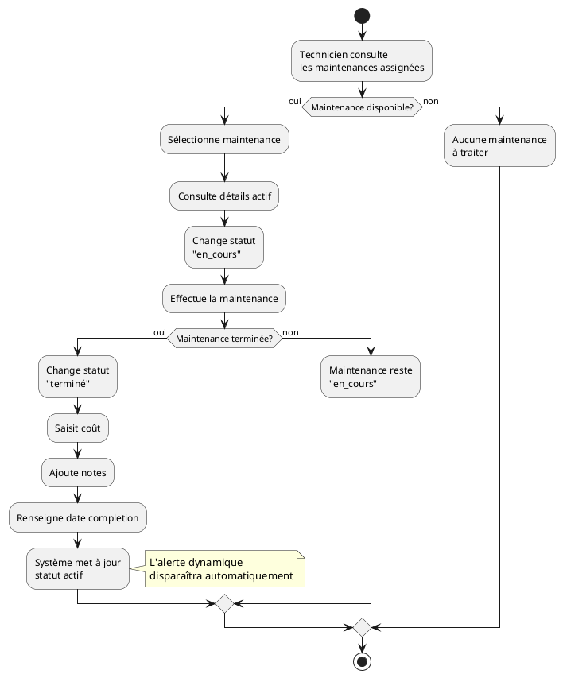

---

## 💬 SPRINT 4: MESSAGERIE

### Figure 6.1: Cas d'Utilisation Messagerie

**Nom fichier:** `figure_6_1_uc_messagerie.png`

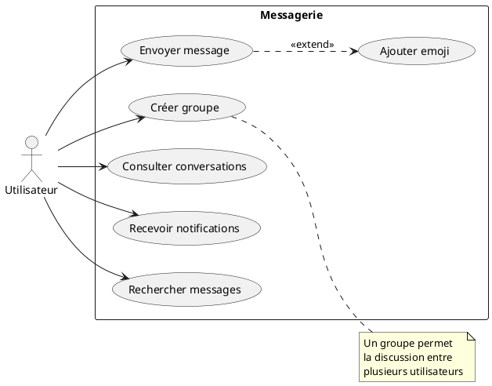

---

### Figure 6.2: Diagramme de Classes Sprint 4

**Nom fichier:** `figure_6_2_classes_sprint4.png`

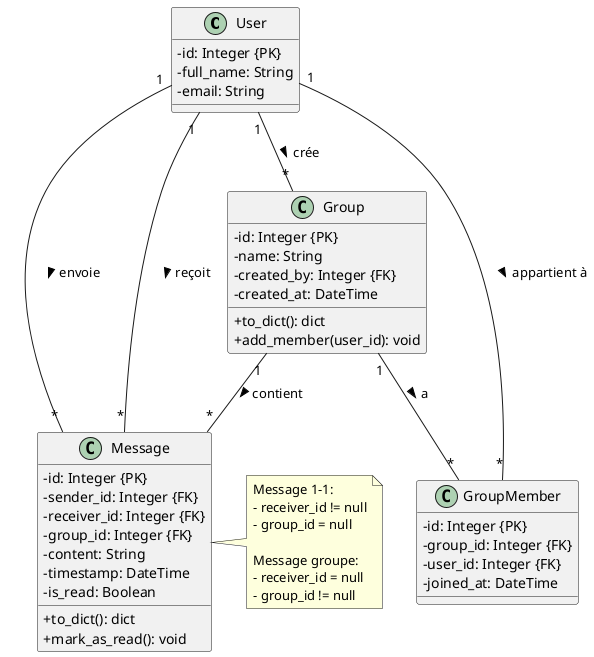

---

### Figure 6.3: Séquence "Envoyer Message"

**Nom fichier:** `figure_6_3_seq_envoyer_message.png`

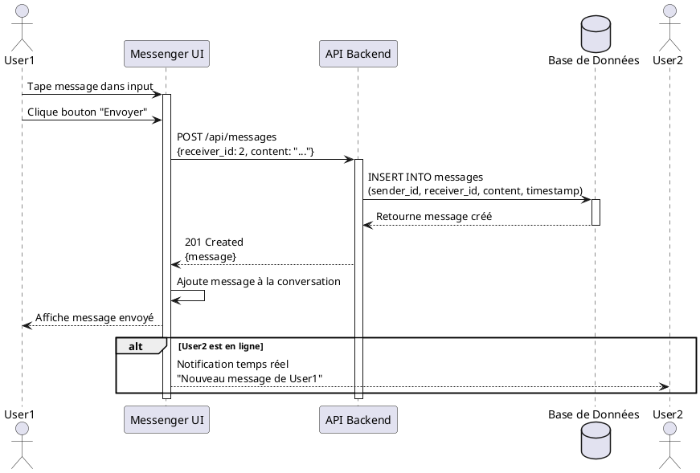

---

### Figure 6.4: Séquence "Créer Groupe"

**Nom fichier:** `figure_6_4_seq_creer_groupe.png`

```plantuml
@startuml
actor "Admin Groupe" as Admin
participant "UI Messenger" as UI
participant "API Backend" as API
database "Base de Données" as DB

Admin -> UI: Clique "Créer Groupe"
activate UI
UI --> Admin: Affiche modal

Admin -> UI: Saisit nom groupe
Admin -> UI: Sélectionne membres\n(User2, User3, User4)
Admin -> UI: Clique "Créer"

UI -> API: POST /api/groups\n{name: "Équipe", members: [2,3,4]}
activate API

API -> DB: INSERT INTO groups\n(name, created_by)
activate DB
DB --> API: Retourne group.id
deactivate DB

loop Pour chaque membre
    API -> DB: INSERT INTO group_members\n(group_id, user_id)
    activate DB
    DB --> API: OK
    deactivate DB
end

API --> UI: 201 Created\n{group}
UI -> UI: Ajoute groupe à la liste
UI --> Admin: Affiche groupe créé\n"Groupe Équipe créé"

deactivate API
deactivate UI

note right of Admin
  Admin peut maintenant
  envoyer des messages
  au groupe
end note

@enduml
```

---

## ✅ RÉCAPITULATIF

**Total: 20 diagrammes UML créés**

### Par Sprint:
- Architecture: 2 diagrammes
- Chapitre 2: 2 diagrammes
- Sprint 1: 6 diagrammes ✅
- Sprint 2: 4 diagrammes ✅
- Sprint 3: 4 diagrammes ✅
- Sprint 4: 4 diagrammes ✅

### Instructions:
1. Copiez chaque code PlantUML
2. Générez sur http://www.plantuml.com/plantuml/uml/
3. Téléchargez PNG
4. Renommez selon le nom indiqué

**Temps estimé: 2-3 heures pour tous les diagrammes**

---

**Tous les diagrammes UML sont prêts à être générés!** 🎨
