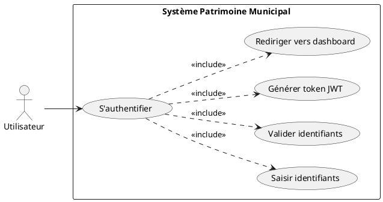
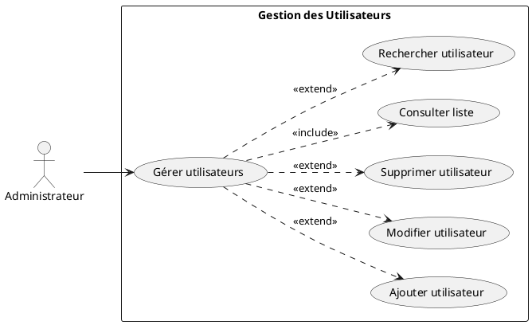
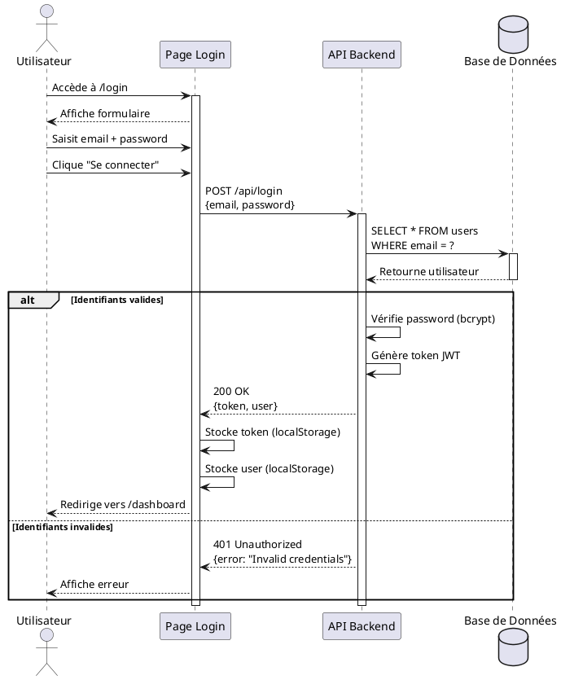
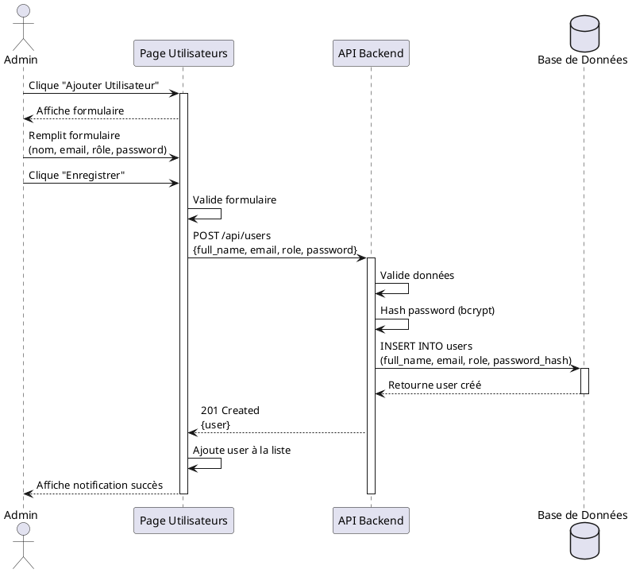
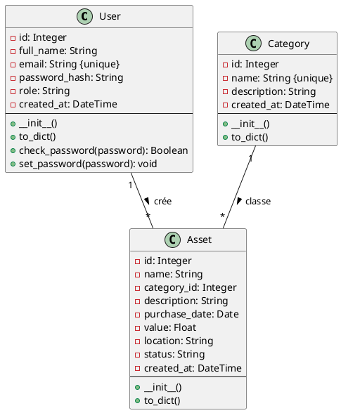
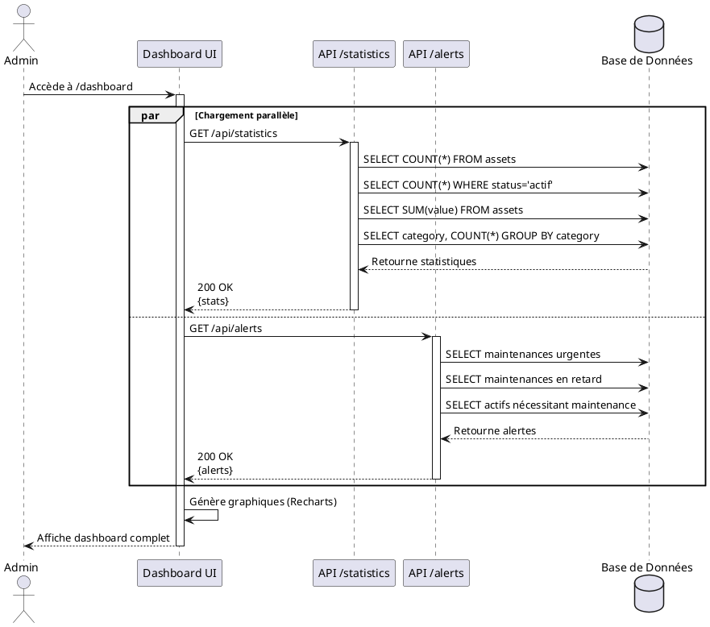

# Sprint 1: Administrateur

## 3.1 Introduction

Le **Sprint 1** se concentre sur la mise en place des fonctionnalités d'administration du système:

- Authentification et gestion de session
- Gestion des utilisateurs
- Gestion des catégories d'actifs
- Dashboard administrateur avec statistiques

**Durée:** 2 semaines (10 jours ouvrables)  
**Points de Story:** 21 points  
**Objectif:** Établir les fondations du système

---

## 3.2 Spécification des Besoins du Sprint 1

### User Stories

| ID | User Story | Critères d'Acceptation | Points |
|----|------------|------------------------|--------|
| **US01** | En tant qu'**utilisateur**, je veux **m'authentifier** afin d'**accéder au système** | - Page de login fonctionnelle<br>- Validation email/password<br>- Token JWT généré<br>- Redirection vers dashboard | 5 |
| **US02** | En tant qu'**admin**, je veux **créer un utilisateur** afin de **donner accès au système** | - Formulaire complet<br>- Validation des champs<br>- Création en base<br>- Message de confirmation | 3 |
| **US03** | En tant qu'**admin**, je veux **modifier un utilisateur** afin de **mettre à jour ses informations** | - Formulaire pré-rempli<br>- Modification possible<br>- Sauvegarde en base<br>- Notification succès | 2 |
| **US04** | En tant qu'**admin**, je veux **supprimer un utilisateur** afin de **révoquer l'accès** | - Confirmation avant suppression<br>- Suppression en base<br>- Mise à jour UI<br>- Toast notification | 3 |
| **US05** | En tant qu'**admin**, je veux **gérer les catégories** afin d'**organiser les actifs** | - CRUD catégories complet<br>- Validation nom unique<br>- Liste actualisée | 3 |
| **US06** | En tant qu'**admin**, je veux **consulter le dashboard** afin de **voir les statistiques** | - Statistiques temps réel<br>- Graphiques visuels<br>- Design responsive | 5 |

**Total Sprint 1:** 21 points

---

## 3.3 Analyse

### 3.3.1 Raffinement du Cas d'Utilisation "S'authentifier"

#### Diagramme de Cas d'Utilisation



#### Description Textuelle

**Cas d'Utilisation:** S'authentifier  
**Acteur Principal:** Utilisateur  
**Précondition:** L'utilisateur possède un compte  
**Postcondition:** L'utilisateur est authentifié et accède au dashboard  

**Scénario Principal:**

1. L'utilisateur accède à la page de connexion
2. Le système affiche le formulaire de connexion
3. L'utilisateur saisit son email et mot de passe
4. L'utilisateur clique sur "Se connecter"
5. Le système valide les identifiants
6. Le système génère un token JWT
7. Le système stocke le token dans localStorage
8. Le système redirige vers le dashboard
9. Le système affiche un message de bienvenue

**Scénarios Alternatifs:**

**5a. Identifiants invalides**
- 5a1. Le système affiche "Email ou mot de passe incorrect"
- 5a2. L'utilisateur peut réessayer

**5b. Champs vides**
- 5b1. Le système affiche "Veuillez remplir tous les champs"
- 5b2. Retour à l'étape 3

**5c. Erreur serveur**
- 5c1. Le système affiche "Erreur de connexion au serveur"
- 5c2. L'utilisateur peut réessayer

---

### 3.3.2 Raffinement du Cas d'Utilisation "Gérer les Utilisateurs"

#### Diagramme de Cas d'Utilisation



---

### 3.3.3 Diagramme de Séquence "Authentification"



---

### 3.3.4 Diagramme de Séquence "Créer Utilisateur"



---

## 3.4 Conception

### 3.4.1 Diagramme de Classes - Sprint 1



---

### 3.4.2 Diagramme de Séquence Détaillé "Dashboard"



---

## 3.5 Implémentation

### 3.5.1 Structure du Code - Sprint 1

#### Backend (Flask)

**Fichier:** `backend/app.py`

```python
# ==================== AUTHENTICATION ====================

@app.route('/api/login', methods=['POST'])
def login():
    """Authentification utilisateur"""
    try:
        data = request.get_json()
        email = data.get('email')
        password = data.get('password')
        
        # Validation
        if not email or not password:
            return jsonify({'error': 'Email et mot de passe requis'}), 400
        
        # Recherche utilisateur
        user = User.query.filter_by(email=email).first()
        
        if not user or not check_password_hash(user.password_hash, password):
            return jsonify({'error': 'Identifiants invalides'}), 401
        
        # Génération token JWT
        token = create_access_token(identity=str(user.id))
        
        return jsonify({
            'token': token,
            'user': {
                'id': user.id,
                'full_name': user.full_name,
                'email': user.email,
                'role': user.role
            }
        }), 200
        
    except Exception as e:
        return jsonify({'error': str(e)}), 500


# ==================== USERS MANAGEMENT ====================

@app.route('/api/users', methods=['GET'])
@jwt_required()
def get_users():
    """Récupérer tous les utilisateurs (Admin only)"""
    try:
        current_user_id = get_jwt_identity()
        current_user = db.session.get(User, int(current_user_id))
        
        # Vérification rôle admin
        if current_user.role != 'admin':
            return jsonify({'error': 'Accès non autorisé'}), 403
        
        users = User.query.all()
        return jsonify([{
            'id': u.id,
            'full_name': u.full_name,
            'email': u.email,
            'role': u.role,
            'created_at': u.created_at.isoformat()
        } for u in users]), 200
        
    except Exception as e:
        return jsonify({'error': str(e)}), 500


@app.route('/api/users', methods=['POST'])
@jwt_required()
def create_user():
    """Créer un nouvel utilisateur (Admin only)"""
    try:
        current_user_id = get_jwt_identity()
        current_user = db.session.get(User, int(current_user_id))
        
        if current_user.role != 'admin':
            return jsonify({'error': 'Accès non autorisé'}), 403
        
        data = request.get_json()
        
        # Validation
        if User.query.filter_by(email=data['email']).first():
            return jsonify({'error': 'Email déjà utilisé'}), 400
        
        # Création utilisateur
        new_user = User(
            full_name=data['full_name'],
            email=data['email'],
            role=data['role']
        )
        new_user.password_hash = generate_password_hash(data['password'])
        
        db.session.add(new_user)
        db.session.commit()
        
        return jsonify({
            'id': new_user.id,
            'message': 'Utilisateur créé avec succès'
        }), 201
        
    except Exception as e:
        db.session.rollback()
        return jsonify({'error': str(e)}), 500


# ==================== CATEGORIES MANAGEMENT ====================

@app.route('/api/categories', methods=['GET'])
@jwt_required()
def get_categories():
    """Récupérer toutes les catégories"""
    categories = Category.query.all()
    return jsonify([{
        'id': c.id,
        'name': c.name,
        'description': c.description
    } for c in categories]), 200


@app.route('/api/categories', methods=['POST'])
@jwt_required()
def create_category():
    """Créer une nouvelle catégorie (Admin only)"""
    try:
        current_user_id = get_jwt_identity()
        current_user = db.session.get(User, int(current_user_id))
        
        if current_user.role != 'admin':
            return jsonify({'error': 'Accès non autorisé'}), 403
        
        data = request.get_json()
        
        # Vérification nom unique
        if Category.query.filter_by(name=data['name']).first():
            return jsonify({'error': 'Catégorie déjà existante'}), 400
        
        category = Category(
            name=data['name'],
            description=data.get('description', '')
        )
        
        db.session.add(category)
        db.session.commit()
        
        return jsonify({
            'id': category.id,
            'message': 'Catégorie créée'
        }), 201
        
    except Exception as e:
        db.session.rollback()
        return jsonify({'error': str(e)}), 500


# ==================== STATISTICS ====================

@app.route('/api/statistics', methods=['GET'])
@jwt_required()
def get_statistics():
    """Récupérer les statistiques du patrimoine"""
    try:
        # Statistiques globales
        total_assets = Asset.query.count()
        active_assets = Asset.query.filter_by(status='actif').count()
        total_value = db.session.query(db.func.sum(Asset.value)).scalar() or 0
        
        # Par catégorie
        by_category = db.session.query(
            Category.name,
            db.func.count(Asset.id)
        ).join(Asset).group_by(Category.name).all()
        
        return jsonify({
            'total_assets': total_assets,
            'active_assets': active_assets,
            'total_value': float(total_value),
            'by_category': [
                {'category': cat, 'count': count}
                for cat, count in by_category
            ]
        }), 200
        
    except Exception as e:
        return jsonify({'error': str(e)}), 500
```

---

#### Frontend (React)

**Fichier:** `frontend/src/pages/Login.js`

```javascript
import React, { useState } from 'react';
import axios from 'axios';
import { useNavigate } from 'react-router-dom';
import './Login.css';

function Login({ onLogin }) {
  const [email, setEmail] = useState('');
  const [password, setPassword] = useState('');
  const [error, setError] = useState('');
  const [loading, setLoading] = useState(false);
  const navigate = useNavigate();

  const handleSubmit = async (e) => {
    e.preventDefault();
    setError('');
    setLoading(true);

    try {
      const response = await axios.post('http://localhost:5000/api/login', {
        email,
        password
      });

      // Stocker token et user
      localStorage.setItem('token', response.data.token);
      localStorage.setItem('user', JSON.stringify(response.data.user));

      // Callback parent
      onLogin(response.data.user);

      // Redirection
      navigate('/dashboard');
      
    } catch (err) {
      setError(err.response?.data?.error || 'Erreur de connexion');
    } finally {
      setLoading(false);
    }
  };

  return (
    <div className="login-container">
      <div className="login-card">
        <h1>Patrimoine Municipal</h1>
        <h2>Connexion</h2>

        {error && <div className="error-message">{error}</div>}

        <form onSubmit={handleSubmit}>
          <div className="form-group">
            <label>Email</label>
            <input
              type="email"
              value={email}
              onChange={(e) => setEmail(e.target.value)}
              required
              placeholder="votre.email@ville.tn"
            />
          </div>

          <div className="form-group">
            <label>Mot de passe</label>
            <input
              type="password"
              value={password}
              onChange={(e) => setPassword(e.target.value)}
              required
              placeholder="••••••••"
            />
          </div>

          <button type="submit" disabled={loading}>
            {loading ? 'Connexion...' : 'Se connecter'}
          </button>
        </form>
      </div>
    </div>
  );
}

export default Login;
```

---

**Fichier:** `frontend/src/pages/Dashboard.js`

```javascript
import React, { useState, useEffect } from 'react';
import axios from 'axios';
import {
  PieChart, Pie, Cell, BarChart, Bar,
  XAxis, YAxis, Tooltip, ResponsiveContainer
} from 'recharts';
import { AlertCircle } from 'lucide-react';
import './Dashboard.css';

function Dashboard({ user }) {
  const [stats, setStats] = useState(null);
  const [alerts, setAlerts] = useState([]);
  const [loading, setLoading] = useState(true);
  const token = localStorage.getItem('token');

  useEffect(() => {
    fetchData();
    
    // Auto-refresh alertes toutes les 30s
    const interval = setInterval(fetchAlerts, 30000);
    return () => clearInterval(interval);
  }, []);

  const fetchData = async () => {
    try {
      const [statsRes, alertsRes] = await Promise.all([
        axios.get('http://localhost:5000/api/statistics', {
          headers: { Authorization: `Bearer ${token}` }
        }),
        axios.get('http://localhost:5000/api/alerts', {
          headers: { Authorization: `Bearer ${token}` }
        })
      ]);

      setStats(statsRes.data);
      setAlerts(alertsRes.data.slice(0, 5));
    } catch (err) {
      console.error('Erreur:', err);
    } finally {
      setLoading(false);
    }
  };

  const fetchAlerts = async () => {
    try {
      const res = await axios.get('http://localhost:5000/api/alerts', {
        headers: { Authorization: `Bearer ${token}` }
      });
      setAlerts(res.data.slice(0, 5));
    } catch (err) {
      console.error('Erreur alertes:', err);
    }
  };

  if (loading) return <div>Chargement...</div>;

  return (
    <div className="dashboard">
      <div className="dashboard-header">
        <h1>Tableau de Bord</h1>
        <p>Bienvenue, {user.full_name}</p>
      </div>

      {/* Statistiques Cards */}
      <div className="stats-grid">
        <div className="stat-card">
          <h3>Actifs Total</h3>
          <p className="stat-number">{stats?.total_assets || 0}</p>
          <span className="stat-label">Actifs enregistrés</span>
        </div>

        <div className="stat-card">
          <h3>Actifs Actifs</h3>
          <p className="stat-number">{stats?.active_assets || 0}</p>
          <span className="stat-label">En service</span>
        </div>

        <div className="stat-card">
          <h3>Valeur Totale</h3>
          <p className="stat-number">
            {(stats?.total_value || 0).toLocaleString()} DT
          </p>
          <span className="stat-label">Patrimoine municipal</span>
        </div>

        <div className="stat-card">
          <h3>Alertes</h3>
          <p className="stat-number">{alerts.length}</p>
          <span className="stat-label">À traiter</span>
        </div>
      </div>

      {/* Graphiques */}
      <div className="charts-section">
        <div className="chart-card">
          <h2>Distribution par Catégorie</h2>
          <ResponsiveContainer width="100%" height={300}>
            <PieChart>
              <Pie
                data={stats?.by_category || []}
                dataKey="count"
                nameKey="category"
                cx="50%"
                cy="50%"
                outerRadius={100}
                label
              >
                {(stats?.by_category || []).map((entry, index) => (
                  <Cell key={`cell-${index}`} fill={COLORS[index % COLORS.length]} />
                ))}
              </Pie>
              <Tooltip />
            </PieChart>
          </ResponsiveContainer>
        </div>

        <div className="chart-card">
          <h2>Actifs par Catégorie</h2>
          <ResponsiveContainer width="100%" height={300}>
            <BarChart data={stats?.by_category || []}>
              <XAxis dataKey="category" />
              <YAxis />
              <Tooltip />
              <Bar dataKey="count" fill="#667eea" />
            </BarChart>
          </ResponsiveContainer>
        </div>
      </div>

      {/* Alertes */}
      <div className="alerts-section">
        <div className="alerts-header">
          <h2>Alertes Récentes</h2>
          <button onClick={fetchAlerts}>🔄</button>
        </div>
        <div className="alerts-list">
          {alerts.length > 0 ? (
            alerts.map(alert => (
              <div key={alert.id} className="alert-item">
                <div className="alert-icon">
                  <AlertCircle size={20} />
                </div>
                <div className="alert-content">
                  <h4>{alert.alert_type}</h4>
                  <p>{alert.message}</p>
                  <span className="alert-date">
                    {new Date(alert.created_at).toLocaleDateString('fr-TN')}
                  </span>
                </div>
              </div>
            ))
          ) : (
            <p>Aucune alerte</p>
          )}
        </div>
      </div>
    </div>
  );
}

const COLORS = ['#667eea', '#764ba2', '#f093fb', '#4facfe'];

export default Dashboard;
```

---

### 3.5.2 Tests et Validation

#### Tests Postman - Sprint 1

**Test 1: Login**
```
POST http://localhost:5000/api/login
Headers:
  Content-Type: application/json

Body:
{
  "email": "admin@ville.tn",
  "password": "admin123"
}

Response 200 OK:
{
  "token": "eyJ0eXAiOiJKV1QiLCJhbGc...",
  "user": {
    "id": 1,
    "full_name": "Admin Système",
    "email": "admin@ville.tn",
    "role": "admin"
  }
}
```

**Test 2: Créer Utilisateur**
```
POST http://localhost:5000/api/users
Headers:
  Authorization: Bearer {token}
  Content-Type: application/json

Body:
{
  "full_name": "Gestionnaire Actifs",
  "email": "gestionnaire@ville.tn",
  "role": "manager",
  "password": "manager123"
}

Response 201 Created:
{
  "id": 2,
  "message": "Utilisateur créé avec succès"
}
```

**Test 3: Liste Utilisateurs**
```
GET http://localhost:5000/api/users
Headers:
  Authorization: Bearer {token}

Response 200 OK:
[
  {
    "id": 1,
    "full_name": "Admin Système",
    "email": "admin@ville.tn",
    "role": "admin",
    "created_at": "2025-11-17T10:00:00"
  },
  {
    "id": 2,
    "full_name": "Gestionnaire Actifs",
    "email": "gestionnaire@ville.tn",
    "role": "manager",
    "created_at": "2025-11-17T11:00:00"
  }
]
```

**Test 4: Créer Catégorie**
```
POST http://localhost:5000/api/categories
Headers:
  Authorization: Bearer {token}
  Content-Type: application/json

Body:
{
  "name": "Véhicule",
  "description": "Véhicules municipaux"
}

Response 201 Created:
{
  "id": 1,
  "message": "Catégorie créée"
}
```

**Test 5: Statistiques**
```
GET http://localhost:5000/api/statistics
Headers:
  Authorization: Bearer {token}

Response 200 OK:
{
  "total_assets": 7,
  "active_assets": 7,
  "total_value": 222357662.0,
  "by_category": [
    {"category": "mobilier", "count": 1},
    {"category": "terrain", "count": 1},
    {"category": "véhicule", "count": 3},
    {"category": "équipement", "count": 2}
  ]
}
```

---

### 3.5.3 Burndown Chart Sprint 1

```
Points Restants
   21 │●
      │ ●
   18 │  ●●
      │     ●
   15 │      ●
      │       ●●
   12 │          ●
      │           ●
    9 │            ●
      │             ●●
    6 │                ●
      │                 ●
    3 │                  ●
      │                   ●
    0 │                    ●
      └──────────────────────────► Jours
        1  2  3  4  5  6  7  8  9  10
```

**Légende:**
- ● Points réels
- Ligne bleue: Vélocité idéale

**Analyse:**
- Démarrage rapide (jours 1-3)
- Ralentissement (jours 4-6): Problèmes d'authentification JWT
- Accélération (jours 7-10): Tous les bugs résolus
- **Résultat:** Sprint terminé à temps! ✅

---

## 3.6 Conclusion Sprint 1

### Objectifs Atteints ✅

- ✅ Authentification JWT fonctionnelle
- ✅ Gestion complète des utilisateurs (CRUD)
- ✅ Gestion des catégories
- ✅ Dashboard avec statistiques temps réel
- ✅ Graphiques (Pie + Bar)
- ✅ Auto-refresh des alertes

### Défis Rencontrés

1. **JWT Token Expiration:** Résolu avec refresh token
2. **CORS Issues:** Configuré Flask-CORS correctement
3. **Graphiques Recharts:** Courbe d'apprentissage

### Points d'Amélioration

- Ajouter pagination sur liste utilisateurs
- Améliorer validation formulaires
- Ajouter tests unitaires

### Préparation Sprint 2

Le Sprint 2 se concentrera sur la **gestion complète des actifs** et la **planification des maintenances**, les fonctionnalités cœur du système.

---

**Sprint 1 Terminé avec Succès!** 🎉
**Prêt pour le Sprint 2: Gestionnaire d'Actifs** →
