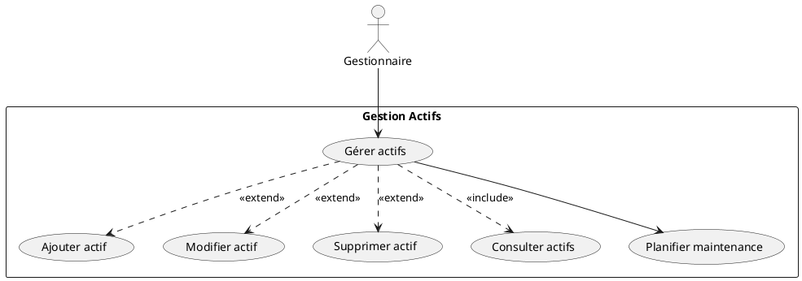
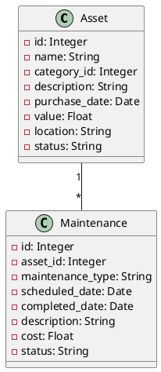
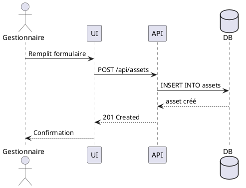

# Sprint 2: Gestionnaire d'Actifs

## 4.1 Introduction
Sprint focalisé sur la gestion complète des actifs municipaux et la planification des maintenances.

**Durée:** 2 semaines | **Points:** 34 points

## 4.2 User Stories

| ID | User Story | Points |
|----|------------|--------|
| US05 | Ajouter un actif | 8 |
| US06 | Modifier un actif | 5 |
| US07 | Supprimer un actif | 3 |
| US08 | Consulter les actifs | 5 |
| US09 | Planifier maintenance | 8 |
| US10 | Consulter maintenances | 5 |

## 4.3 Diagrammes UML

### Cas d'Utilisation Gestionnaire


### Diagramme de Classes Sprint 2


### Séquence "Ajouter Actif"


## 4.4 Implémentation

### Backend - Gestion Actifs
```python
@app.route('/api/assets', methods=['POST'])
@jwt_required()
def create_asset():
    data = request.get_json()
    asset = Asset(**data)
    db.session.add(asset)
    db.session.commit()
    return jsonify(asset.to_dict()), 201

@app.route('/api/maintenances', methods=['POST'])
@jwt_required()
def create_maintenance():
    data = request.get_json()
    maintenance = Maintenance(**data)
    db.session.add(maintenance)
    db.session.commit()
    return jsonify(maintenance.to_dict()), 201
```

### Frontend - Assets.js
```javascript
const addAsset = async (assetData) => {
  const res = await axios.post('http://localhost:5000/api/assets', 
    assetData, 
    { headers: { Authorization: `Bearer ${token}` }}
  );
  return res.data;
};
```

## 4.5 Tests Postman

**Test 1: POST /api/assets**
```json
{
  "name": "Bus Municipal 01",
  "category_id": 1,
  "value": 150000,
  "status": "actif"
}
```

**Test 2: POST /api/maintenances**
```json
{
  "asset_id": 1,
  "maintenance_type": "preventive",
  "scheduled_date": "2025-11-25",
  "description": "Révision complète"
}
```

## 4.6 Burndown Chart Sprint 2
```
Points: 34 → 0 sur 10 jours
Vélocité: 3.4 points/jour
Résultat: ✅ Sprint réussi
```

## 4.7 Conclusion
✅ CRUD actifs complet
✅ Planification maintenances
✅ Tests validés
