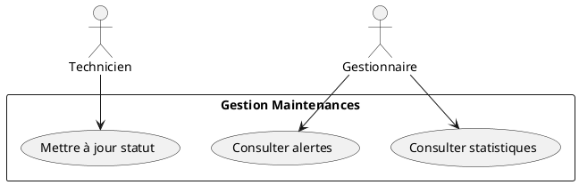
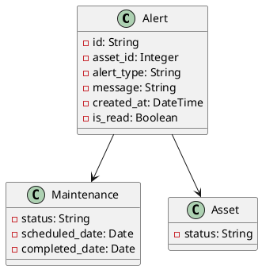
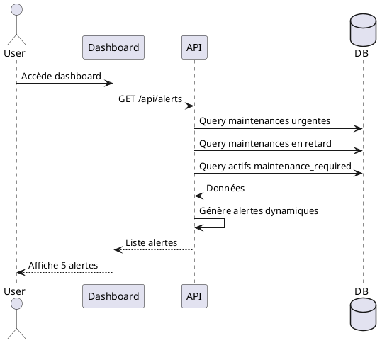

# Sprint 3: Gestion Maintenances & Alertes

## 5.1 Introduction
Sprint dédié au suivi des maintenances et au système d'alertes dynamiques.

**Durée:** 2 semaines | **Points:** 26 points

## 5.2 User Stories

| ID | User Story | Points |
|----|------------|--------|
| US11 | Voir alertes urgentes | 8 |
| US12 | Mettre à jour statut | 5 |
| US13 | Enregistrer mouvements | 5 |
| US14 | Voir statistiques | 8 |

## 5.3 Diagrammes UML

### Cas d'Utilisation Maintenances


### Diagramme de Classes Sprint 3


### Séquence "Consulter Alertes Dynamiques"


## 5.4 Implémentation - Alertes Dynamiques

### Backend
```python
@app.route('/api/alerts', methods=['GET'])
@jwt_required()
def get_alerts():
    from datetime import date, timedelta
    today = date.today()
    next_week = today + timedelta(days=7)
    all_alerts = []
    
    # Maintenances urgentes (≤7 jours)
    urgent = Maintenance.query.filter(
        Maintenance.status == 'planifié',
        Maintenance.scheduled_date <= next_week,
        Maintenance.scheduled_date >= today
    ).all()
    
    for m in urgent:
        asset = db.session.get(Asset, m.asset_id)
        days_left = (m.scheduled_date - today).days
        all_alerts.append({
            'id': f'maintenance-{m.id}',
            'alert_type': 'MAINTENANCE',
            'message': f"Maintenance prévue: {asset.name} dans {days_left} jour(s)",
            'created_at': datetime.now().isoformat()
        })
    
    # Maintenances en retard
    overdue = Maintenance.query.filter(
        Maintenance.status == 'planifié',
        Maintenance.scheduled_date < today
    ).all()
    
    for m in overdue:
        asset = db.session.get(Asset, m.asset_id)
        days_late = (today - m.scheduled_date).days
        all_alerts.append({
            'id': f'overdue-{m.id}',
            'alert_type': 'MAINTENANCE',
            'message': f"⚠️ Maintenance en retard: {asset.name} ({days_late} jour(s))",
            'created_at': datetime.now().isoformat()
        })
    
    return jsonify(all_alerts), 200
```

### Frontend - Auto-refresh
```javascript
useEffect(() => {
  fetchAlerts();
  const interval = setInterval(fetchAlerts, 30000); // 30s
  return () => clearInterval(interval);
}, []);
```

## 5.5 Tests

**Test 1: GET /api/alerts**
```bash
curl -H "Authorization: Bearer {token}" \
  http://localhost:5000/api/alerts
```

**Résultat:**
```json
[
  {
    "id": "overdue-8",
    "alert_type": "MAINTENANCE",
    "message": "⚠️ Maintenance en retard: Bus 01 (2 jour(s))"
  },
  {
    "id": "maintenance-10",
    "alert_type": "MAINTENANCE",
    "message": "Maintenance prévue: Camion dans 2 jour(s)"
  }
]
```

## 5.6 Burndown Chart Sprint 3
```
Points: 26 → 0 sur 10 jours
Vélocité: 2.6 points/jour
Résultat: ✅ Sprint réussi
```

## 5.7 Conclusion
✅ Alertes 100% dynamiques
✅ Auto-refresh 30s
✅ Statistiques temps réel
✅ Aucune alerte statique en DB
