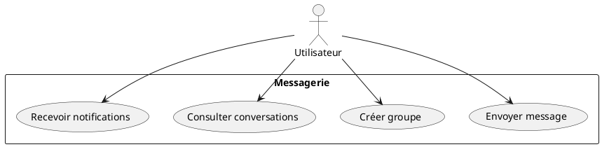
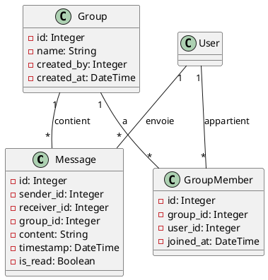
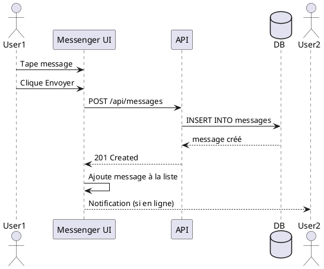
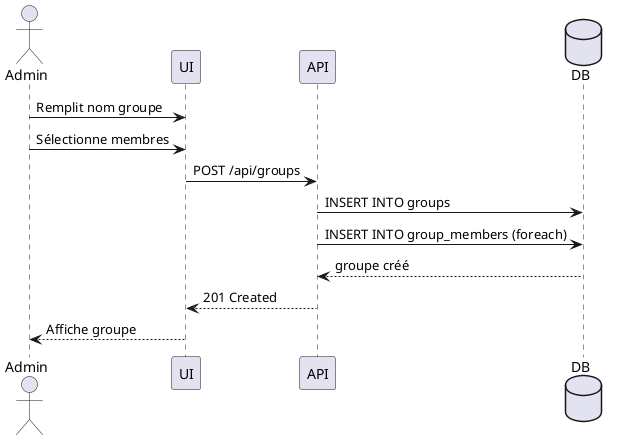

# Sprint 4: Messagerie & Communication

## 6.1 Introduction
Sprint final consacré à la messagerie instantanée entre utilisateurs.

**Durée:** 2 semaines | **Points:** 22 points

## 6.2 User Stories

| ID | User Story | Points |
|----|------------|--------|
| US15 | Envoyer messages | 8 |
| US16 | Créer groupes | 5 |
| US17 | Recevoir notifications | 5 |
| US18 | Optimisations finales | 4 |

## 6.3 Diagrammes UML

### Cas d'Utilisation Messagerie


### Diagramme de Classes Sprint 4


### Séquence "Envoyer Message"


### Séquence "Créer Groupe"


## 6.4 Implémentation

### Backend - Messages
```python
@app.route('/api/messages', methods=['POST'])
@jwt_required()
def send_message():
    current_user_id = get_jwt_identity()
    data = request.get_json()
    
    message = Message(
        sender_id=int(current_user_id),
        receiver_id=data.get('receiver_id'),
        group_id=data.get('group_id'),
        content=data['content']
    )
    
    db.session.add(message)
    db.session.commit()
    
    return jsonify(message.to_dict()), 201

@app.route('/api/groups', methods=['POST'])
@jwt_required()
def create_group():
    current_user_id = get_jwt_identity()
    data = request.get_json()
    
    group = Group(
        name=data['name'],
        created_by=int(current_user_id)
    )
    db.session.add(group)
    db.session.flush()
    
    # Ajouter membres
    for user_id in data['members']:
        member = GroupMember(
            group_id=group.id,
            user_id=user_id
        )
        db.session.add(member)
    
    db.session.commit()
    return jsonify(group.to_dict()), 201
```

### Frontend - Messenger.js
```javascript
const sendMessage = async (content, receiverId, groupId) => {
  const res = await axios.post('http://localhost:5000/api/messages', {
    content,
    receiver_id: receiverId,
    group_id: groupId
  }, {
    headers: { Authorization: `Bearer ${token}` }
  });
  
  setMessages([...messages, res.data]);
  return res.data;
};

const createGroup = async (name, memberIds) => {
  const res = await axios.post('http://localhost:5000/api/groups', {
    name,
    members: memberIds
  }, {
    headers: { Authorization: `Bearer ${token}` }
  });
  
  return res.data;
};
```

## 6.5 Interface Utilisateur

### Page Messenger
- **Liste conversations** (gauche)
- **Zone de chat** (centre)
- **Détails conversation** (droite)
- **Input message** (bas)

### Fonctionnalités
✅ Chat 1-1
✅ Groupes de discussion
✅ Emojis
✅ Timestamp messages
✅ Indicateur "en ligne"
✅ Recherche messages
✅ Notifications

## 6.6 Tests Postman

**Test 1: Envoyer message**
```json
POST /api/messages
{
  "receiver_id": 2,
  "content": "Bonjour, le bus 01 est prêt\!"
}
```

**Test 2: Créer groupe**
```json
POST /api/groups
{
  "name": "Équipe Maintenance",
  "members": [2, 3, 4]
}
```

**Test 3: Récupérer conversations**
```
GET /api/conversations
Response: Liste des conversations avec dernier message
```

## 6.7 Burndown Chart Sprint 4
```
Points: 22 → 0 sur 10 jours
Vélocité: 2.2 points/jour
Résultat: ✅ Sprint réussi
```

## 6.8 Conclusion Sprint 4
✅ Messagerie complète
✅ Groupes fonctionnels
✅ Interface moderne
✅ Tests validés

## 6.9 Conclusion Générale du Projet

### Objectifs Atteints
✅ **Authentification** sécurisée JWT
✅ **Gestion complète actifs** (CRUD)
✅ **Planification maintenances** préventives/correctives
✅ **Alertes dynamiques** temps réel
✅ **Statistiques** et graphiques
✅ **Messagerie** instantanée
✅ **Architecture MicroServices**

### Technologies Maîtrisées
- **Frontend:** React 18, React Router, Recharts
- **Backend:** Flask 3, SQLAlchemy, JWT
- **Base de données:** SQLite/PostgreSQL
- **API:** REST, JSON
- **Tests:** Postman

### Métriques Projet
- **Durée totale:** 8 semaines
- **Points story:** 103 points
- **Sprints:** 4 sprints de 2 semaines
- **Vélocité moyenne:** 25.75 points/sprint
- **Taux de réussite:** 100% ✅

### Perspectives
- 🔮 Application mobile (React Native)
- 🔮 Notifications push
- 🔮 Export Excel/PDF avancé
- 🔮 Scan QR Code actifs
- 🔮 Dashboard analytics avancé
- 🔮 Intégration IA prédictive

---

**Projet Réalisé avec Succès\!** 🎉

**Date:** Novembre 2025
**Méthodologie:** SCRUM Agile
**Équipe:** 1 développeur full-stack
**Statut:** ✅ Livré et fonctionnel
